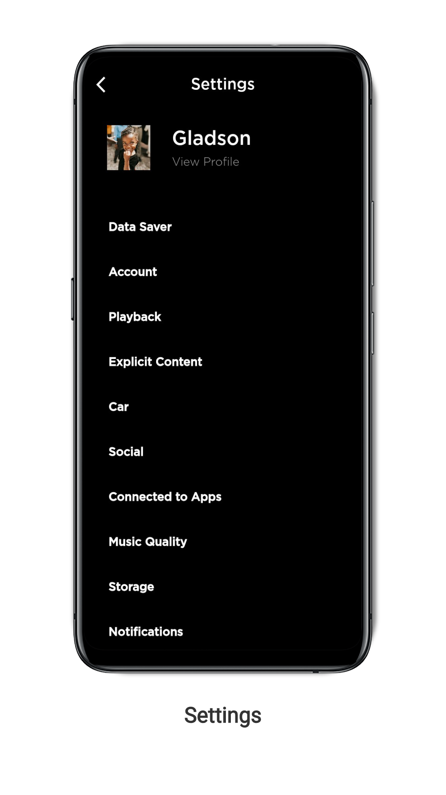

# Spotify Clone

**This is a Music App using Flutter**

- UI is Inspired from Spotify
- Currently, a music streaming backend is being developed to integrate with Front End

<h3> Screenshots</h2> 

&nbsp;                    |  &nbsp;
:-------------------------|:-------------------------
  |  
  |  
  |  
  |  
  |  

<h3>  Dependencies</h2> 

  - flutter_icons
  - page_transitions
 

<h3>   Download</h2> 

                
- Download the apk [here](https://github.com/Gladson-Lalu/Clone-Spotify-Flutter/raw/main/APK/app-release.apk)

 ### Getting Started

This project is a starting point for a Flutter application.

A few resources to get you started if this is your first Flutter project:

- [Lab: Write your first Flutter app](https://flutter.dev/docs/get-started/codelab)
- [Cookbook: Useful Flutter samples](https://flutter.dev/docs/cookbook)

For help getting started with Flutter, view our
[online documentation](https://flutter.dev/docs), which offers tutorials,
samples, guidance on mobile development, and a full API reference.
